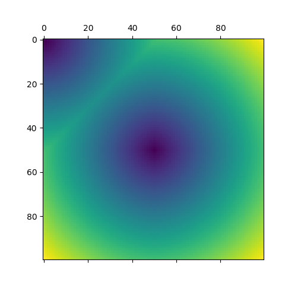

# Fast marching method （快速行进算法）
**2、3维快速行进算法。具体参考文章《LPPN》(还没写完)**
目前是1阶迭代。

## 文件说明
- 最小堆文件:heap.c
    - 用于计算最小堆
    - heap_create:创建堆
- 快速行进:fmm.c 
    - 用于快速行进算法

## 使用说明
- 首先需要进行编译主文件，用于执行。

> gcc main.c heap.c fmm.c fmm.h heap.h -o test -std=c99 -O2 -lm

本来应该是make直接编译的，但是makefile写不好，所以先不写了。
- 使用Python读取速度文件并进行计算
- 文件结构为

|名称|大小|类型|说明|
|:-:|:-:|:-:|:-:|
|坐标类型|4|int|0:笛卡儿坐标，1:柱坐标，2:球坐标| 
|n1,n2,n3|4*3|int|坐标点数，当n3=0为二维|
|b1,b2,b3|4*3|int|起始点|
|d1,d2,d3|4*3|int|坐标间隔|
|数据|4*N|int|一维数据点|

没有考虑大小端问题。 
可以直接运行演示文件：
> fmm.py

## 输出结果为

## 其他文件
myfmm.py是测试用的

## 计算公式
网格点时间
$t=\frac{1}{d_{1}^{2} d_{2}^{2} + d_{1}^{2} d_{3}^{2} + d_{2}^{2} d_{3}^{2}} \left(d_{1}^{2} d_{2}^{2} t_{3} + d_{1}^{2} d_{3}^{2} t_{2} + d_{1} d_{2} d_{3} \sqrt{d_{1}^{2} d_{2}^{2} v + d_{1}^{2} d_{3}^{2} v - d_{1}^{2} t_{2}^{2} + 2 d_{1}^{2} t_{2} t_{3} - d_{1}^{2} t_{3}^{2} + d_{2}^{2} d_{3}^{2} v - d_{2}^{2} t_{1}^{2} + 2 d_{2}^{2} t_{1} t_{3} - d_{2}^{2} t_{3}^{2} - d_{3}^{2} t_{1}^{2} + 2 d_{3}^{2} t_{1} t_{2} - d_{3}^{2} t_{2}^{2}} + d_{2}^{2} d_{3}^{2} t_{1}\right)$